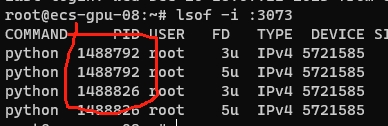

# to start the service

1. login to the server

```
ssh root@37.224.68.132 -p 50029
```

2. enter virtual environment

```
conda activate qa_from_doc_authority
```

3. enter the directory

```
cd /data/home/jim.wang/fm_semantic_search_3073
```

4. check the running program at port 3073

```
lsof -i :3073
```




if any program running then kill it 

```
kill -9 <replace by the PID of above screenshot>
```

5. start the flask service

```
( python app_path.py >> log.txt <&- &  )
```

6. open the following URL

http://37.224.68.132:27373/

# facility_management_semantic_search
Semantic search API for FM

pip install Flask==2.2.2

pip install flasgger==0.9.5

pip install Werkzeug==2.2.2

pip install flask-restx==1.0.3

pip install Flask-Session==0.5.0


